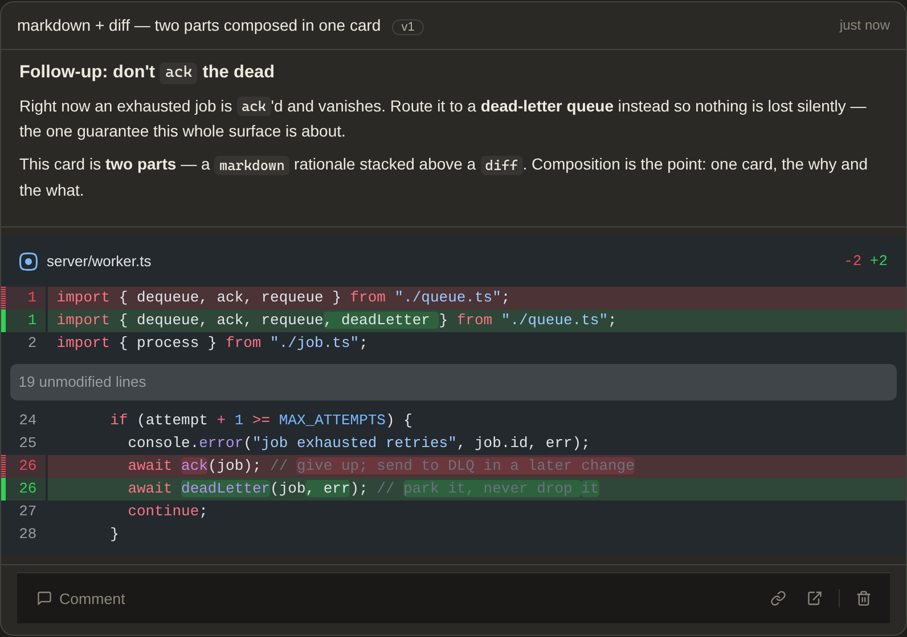

# sideshow

[](https://github.com/modem-dev/sideshow/actions/workflows/ci.yml)
[](LICENSE)

A live visual surface for terminal coding agents.

Let agents say it in more than text — HTML diagrams and UI sketches, rendered
markdown, syntax-highlighted diffs, terminal output, images. sideshow is a
small server with a browser viewer: agents publish **surfaces** from the
terminal, they render live, and you comment back. Your comments reach the agent.

<picture>
  <source media="(prefers-color-scheme: dark)" srcset="docs/sideshow-dark.png">
  
</picture>

An agent sketched a sequence diagram during an auth refactor; the user asked a
question under it, and the agent replied and revised.

The loop — publish, render, comment, revise:


## Quick start

Requires Node 22.18 or newer.

```sh
npm install
npx sideshow serve --open   # viewer on http://localhost:4242
```

Then point your agent at the surface:

```sh
curl -s http://localhost:4242/setup >> AGENTS.md
```

That block teaches any agent with a shell (pi, opencode, amp, codex, Claude
Code) to publish surfaces and poll for comments over curl.

No agent handy? `npx sideshow demo` seeds two example sessions to look around.

## Connecting agents

Pick whichever tier the agent supports — each one covers the full loop.

**Shell.** The `sideshow` CLI has no dependencies and groups sessions for you:

```sh
sideshow publish sketch.html --title "Cache layout"
sideshow diff change.patch --title "Refactor"   # or markdown / image / terminal
sideshow wait                                   # block until the user comments
```

**Pi extension.** Pi users can install the package directly. It adds native
`sideshow_*` tools for publishing/updating surfaces, uploading assets, waiting
for feedback, and replying in browser threads:

```sh
pi install npm:sideshow
# or try it for one run:
pi -e npm:sideshow
```

**MCP.** Tools: `publish_surface`, `update_surface`, `publish_snippet`,
`update_snippet`, `wait_for_feedback`, `reply_to_user`, `list_surfaces`,
`upload_asset`, `get_design_guide`. Connect over stdio or straight to the
server at `/mcp`:

```sh
claude mcp add --scope user sideshow -- npx -y sideshow mcp
# or, no local process:
claude mcp add --scope user --transport http sideshow http://localhost:4242/mcp
```

**Plain HTTP.** `POST /api/surfaces`, `PUT /api/surfaces/:id`, `POST /api/assets`
for blob uploads, and `GET /api/comments?wait=60` for long-polling. The legacy
`/api/snippets` endpoints still work as html-only aliases. Documented at `/guide`.

MCP agents get usage instructions automatically; everything else uses the
`/setup` block above. Claude Code users can also install the skill in
`skills/sideshow/` (`cp -r skills/sideshow ~/.claude/skills/`).

### Claude Code plugin

Claude Code users can install a plugin that bundles all three at once — the
MCP server, the skill, and a **background monitor** that streams your browser
comments to the agent as notifications, so feedback arrives without pasting or
re-arming a watcher:

```text
/plugin marketplace add modem-dev/sideshow
/plugin install sideshow@sideshow
```

On install it asks for your **Sideshow URL** (default `http://localhost:4242`,
or your deployed instance) and an optional token. The monitor runs
`sideshow watch` against your board; comments are delivered to the agent
exactly once. Requires Claude Code ≥ 2.1.105. The viewer's "connect Claude
Code" link (sidebar footer) shows the same steps. The plugin lives in
[`plugin/`](plugin/).

## Concepts

- **Session** — one agent conversation. Sessions appear in the viewer sidebar;
  click a title to rename, hover to delete.
- **Surface** — one published card, built from an ordered list of **parts**.
  Each part has a kind: `html`, `markdown`, `diff`, `terminal`, or `image`.
  Combine them — e.g. a markdown rationale above a diff. `html` parts
  render in a sandboxed iframe (`sandbox="allow-scripts"`, no same-origin) under
  a CSP that limits external resources to a short CDN allowlist; the other kinds
  are data the trusted viewer renders natively. Updating a surface creates a new
  version; old versions stay viewable. A _snippet_ is sugar for a single `html`
  part.
- **Comment thread** — every surface has one. You write in the browser; agents
  read via long-poll (`sideshow wait` or `wait_for_feedback`) and reply. An
  `html` part can also call `sendPrompt('...')` to post to its own thread.

The design contract at `/guide` tells agents how to write surfaces that fit the
viewer: fragment-only HTML, theme CSS variables, dark mode rules, and when to
reach for each part kind.

## Surface kinds

Every card below is real — published over the same API and captured straight
from the viewer. Regenerate them with `node scripts/shoot-surfaces.mjs`.

<table>
  <tr>
    <td width="50%" valign="top">
      
      <p><b><code>html</code></b> — markup you author, rendered sandboxed. Shapes and buttons call <code>sendPrompt()</code> to post back to the thread.</p>
    </td>
    <td width="50%" valign="top">
      
      <p><b><code>markdown</code></b> — prose, tables, and fenced code handed over as text, rendered in the viewer's own typography.</p>
    </td>
  </tr>
  <tr>
    <td width="50%" valign="top">
      
      <p><b><code>diff</code></b> — a patch rendered natively as a syntax-highlighted code review (unified or split).</p>
    </td>
    <td width="50%" valign="top">
      
      <p><b><code>terminal</code></b> — monospace output with ANSI color, in a terminal-window frame.</p>
    </td>
  </tr>
  <tr>
    <td width="50%" valign="top">
      
      <p><b><code>trace</code></b> — an agent run as a step timeline, each step expandable to its detail.</p>
    </td>
    <td width="50%" valign="top">
      
      <p><b><code>image</code></b> — an uploaded, content-addressed asset (screenshot, generated chart) rendered with a caption.</p>
    </td>
  </tr>
  <tr>
    <td width="50%" valign="top">
      
      <p><b>Parts compose.</b> One card can carry several — here a <code>markdown</code> rationale stacked above its <code>diff</code>, so a single surface holds the why and the what.</p>
    </td>
    <td width="50%" valign="top"></td>
  </tr>
</table>

## Architecture

- `server/app.ts` — runtime-agnostic Hono app: REST API, SSE live feed,
  long-poll comments, surface renderer, asset upload/serve.
- `server/types.ts` — data model (surfaces, parts, assets) and the `Store`
  interface.
- `server/storage.ts` — `JsonFileStore` (local Node); `workers/sqlStore.ts` is
  the Durable Object SQLite store. Both pass the same store contract.
- `server/surfacePage.ts` — the sandboxed document and postMessage bridge for an
  `html` part. `server/mcpHttp.ts` — stateless MCP at `/mcp`.
- `viewer/` — the viewer (Solid), Vite-built into a single self-contained
  `viewer/dist/index.html`.
- `bin/sideshow.js` — CLI, Node built-ins only.
- `mcp/server.ts` — stdio MCP server, a thin client over the HTTP API.
- `workers/` — Cloudflare entry point and SQLite store.
- `server/public.ts` — the `sideshow/server` package export, for embedding the
  app in your own Node process.

## Deploying to Cloudflare

The same app runs on Cloudflare Workers — for when agents run on a different
machine than the browser, or you want the viewer on your phone.

```sh
npx wrangler login
npx wrangler secret put SIDESHOW_TOKEN   # any long random string
npm run deploy                           # https://sideshow.<account>.workers.dev
```

A deployed instance requires the token on every request. Open the viewer once
as `/?key=<token>` to set a cookie. Agents need two environment variables; the
CLI and stdio MCP pick them up automatically:

```sh
export SIDESHOW_URL=https://sideshow.<account>.workers.dev
export SIDESHOW_TOKEN=<token>
```

Remote agents can connect MCP straight to the deployment:

```sh
claude mcp add --transport http sideshow https://sideshow.<account>.workers.dev/mcp \
  --header "Authorization: Bearer $SIDESHOW_TOKEN"
```

The whole app runs inside a single Durable Object with SQLite storage. One
instance per board keeps the in-memory event bus authoritative, so SSE and
long-polling behave the same as the local server.

## Terminal surface (experimental)

[`sideshow-term/`](sideshow-term/) is an early **alpha** sibling that renders to
a TUI instead of the browser: agents publish STML (a small HTML-like markup) and
you watch it render live in a spare terminal. It ships as its own package and
requires [Bun](https://bun.sh) for the viewer. APIs are unstable — see
[`sideshow-term/README.md`](sideshow-term/README.md).

## Development

```sh
npm run dev          # server with watch + viewer watch build
npm test             # node --test (unit/API + store contract)
npm run typecheck    # three tsc programs: node + workers + viewer
npm run lint         # oxlint
npm run format       # oxfmt
```

The server and CLI have no build step — TypeScript runs directly on Node via
native type-stripping, and the npm package ships compiled JS built on prepack.
The viewer (`viewer/src/`, Solid) is the exception: Vite builds it into a
single self-contained `viewer/dist/index.html` (`npm run build:viewer`). See
[AGENTS.md](AGENTS.md) for architecture rules.

## License

[MIT](LICENSE)
