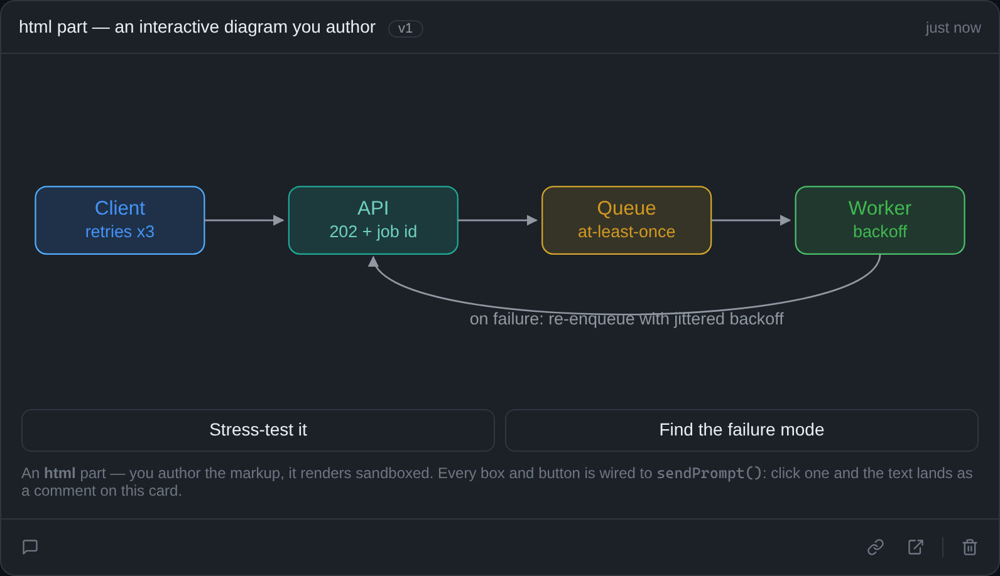
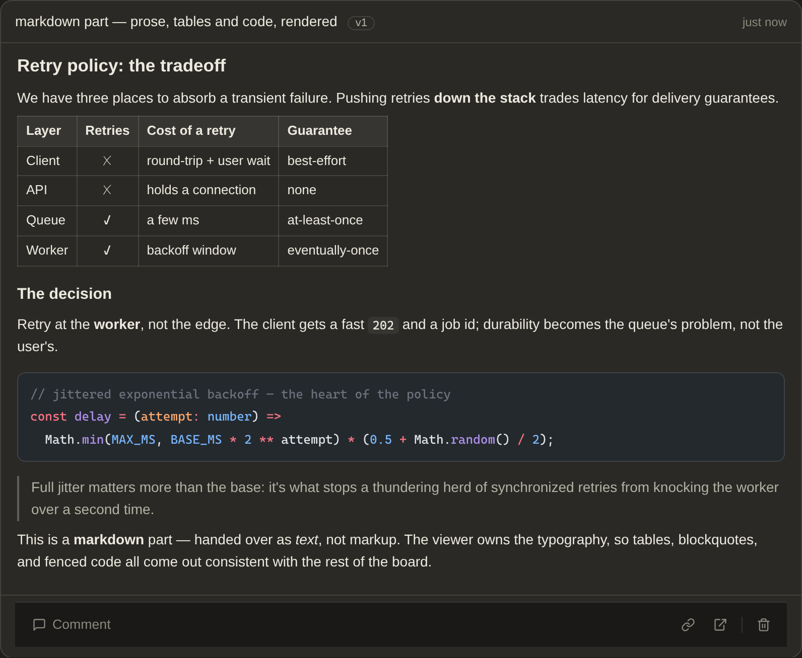
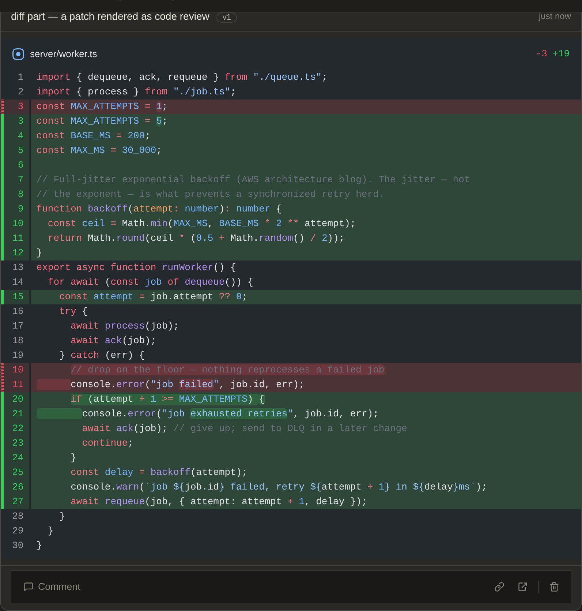
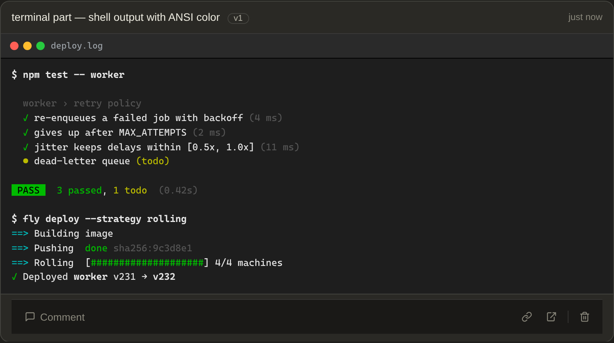
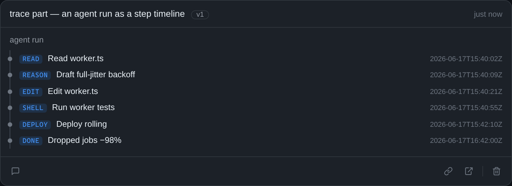
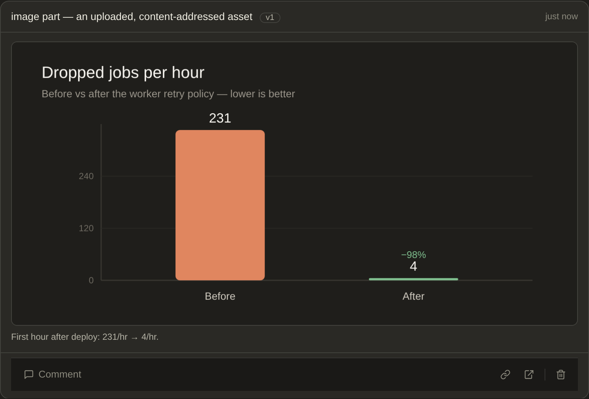
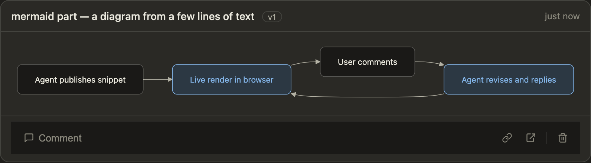

# sideshow

[](https://github.com/modem-dev/sideshow/actions/workflows/ci.yml)
[](LICENSE)

**A live visual surface for your terminal coding agent.**

Your agent works in a wall of text. sideshow gives it a screen. It publishes
**surfaces** — diagrams, UI sketches, rendered markdown, syntax-highlighted
diffs, terminal output, images — and they render live in your browser while it
works. You comment back, and your comments reach the agent. Publish, render,
comment, revise: a two-way loop, right next to the conversation.

<picture>
  <source media="(prefers-color-scheme: dark)" srcset="docs/sideshow-dark.png">
  
</picture>


## Why

- **See what your agent means.** An architecture it's proposing, a flow it's
  tracing, a UI it's about to build — shown, not described in a paragraph you
  have to picture in your head.
- **Faster, and fewer tokens.** sideshow surfaces are optimized for LLMs, so the
  agent produces higher-fidelity diagrams and visualizations faster and using
  fewer tokens.
- **Comment instead of re-prompting.** Click a card, leave a note. The agent
  reads it and revises — no copy-pasting screenshots or re-describing what you
  meant.
- **Works with the agent you already use.** Any agent with a shell can drive it
  over `curl`; richer tiers exist for CLI, MCP, Pi, and Claude Code.

## Quick start

Requires Node 22.18 or newer.

```sh
npm install
npx sideshow serve --open   # viewer on http://localhost:4242
```

Then point your agent at the surface — paste the setup block into its
instructions:

```sh
curl -s http://localhost:4242/setup >> AGENTS.md
```

That teaches any agent with a shell (Pi, opencode, amp, codex, Claude Code) to
publish surfaces and read your comments. Ask it to "sketch this on sideshow" and
watch the card appear.

The running viewer has the same handoff built in: its sidebar footer carries an
**agent setup** link (the block above) and a **Connect Claude Code** button, so
you can grab it without leaving the browser.

No agent handy? `npx sideshow demo` seeds two example sessions to look around.

**Going further:** richer integration tiers (CLI, MCP, the Pi extension, and the
Claude Code skill + plugin) are in **[docs/connecting-agents.md](docs/connecting-agents.md)**.

## What your agent can show

Every card below is real — published over the API and captured straight from the
viewer. A surface is an ordered list of **parts**; one card can carry several.

<table>
  <tr>
    <td width="50%" valign="top">
      
      <p><b><code>html</code></b> — markup the agent authors, rendered sandboxed. Shapes and buttons can call <code>sendPrompt()</code> to post back to the thread.</p>
    </td>
    <td width="50%" valign="top">
      
      <p><b><code>markdown</code></b> — prose, tables, and fenced code handed over as text, rendered in the viewer's own typography.</p>
    </td>
  </tr>
  <tr>
    <td width="50%" valign="top">
      
      <p><b><code>diff</code></b> — a patch rendered natively as a syntax-highlighted code review (unified or split).</p>
    </td>
    <td width="50%" valign="top">
      
      <p><b><code>terminal</code></b> — monospace output with ANSI color, in a terminal-window frame.</p>
    </td>
  </tr>
  <tr>
    <td width="50%" valign="top">
      
      <p><b><code>trace</code></b> — an agent run as a step timeline, each step expandable to its detail.</p>
    </td>
    <td width="50%" valign="top">
      
      <p><b><code>image</code></b> — an uploaded, content-addressed asset (screenshot, generated chart) rendered with a caption.</p>
    </td>
  </tr>
  <tr>
    <td width="50%" valign="top">
      
      <p><b><code>mermaid</code></b> — a few lines of diagram source, rendered to an SVG in the sideshow palette. Tag nodes with <code>:::accent</code> to highlight them.</p>
    </td>
    <td width="50%" valign="top">
      
      <p><b>Parts compose.</b> One card can carry several — here a <code>markdown</code> rationale stacked above its <code>diff</code>, so a single surface holds the why and the what.</p>
    </td>
  </tr>
</table>

## Run it anywhere

sideshow runs locally as a small Node server, or on Cloudflare Workers when your
agent and your browser live on different machines (or you want the viewer on your
phone). See **[docs/deploying.md](docs/deploying.md)**.

## Docs

- **[Connecting agents](docs/connecting-agents.md)** — every integration tier in
  detail: CLI, MCP, Pi, plain HTTP, and the Claude Code skill + plugin.
- **[Deploying to Cloudflare](docs/deploying.md)** — run a shared, tokened
  instance.
- **[AGENTS.md](AGENTS.md)** — architecture and contributor guide.
- **Terminal surface (alpha).** [`sideshow-term/`](sideshow-term/) is an early
  sibling that renders to a TUI instead of the browser. APIs are unstable.

## Development

```sh
npm run dev          # server with watch + viewer watch build
npm test             # node --test (unit/API + store contract)
npm run typecheck    # three tsc programs: node + workers + viewer
npm run lint         # oxlint
npm run format       # oxfmt
```

The server and CLI have no build step — TypeScript runs directly on Node via
native type-stripping, and the npm package ships compiled JS built on prepack.
The viewer (`viewer/src/`, Solid) is Vite-built into a single self-contained
`viewer/dist/index.html` (`npm run build:viewer`). See
[AGENTS.md](AGENTS.md) for the full architecture and rules.

## License

[MIT](LICENSE)
